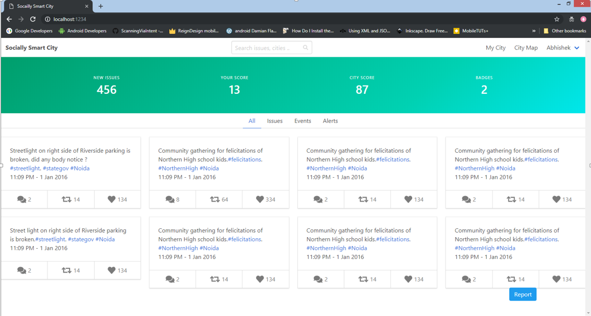
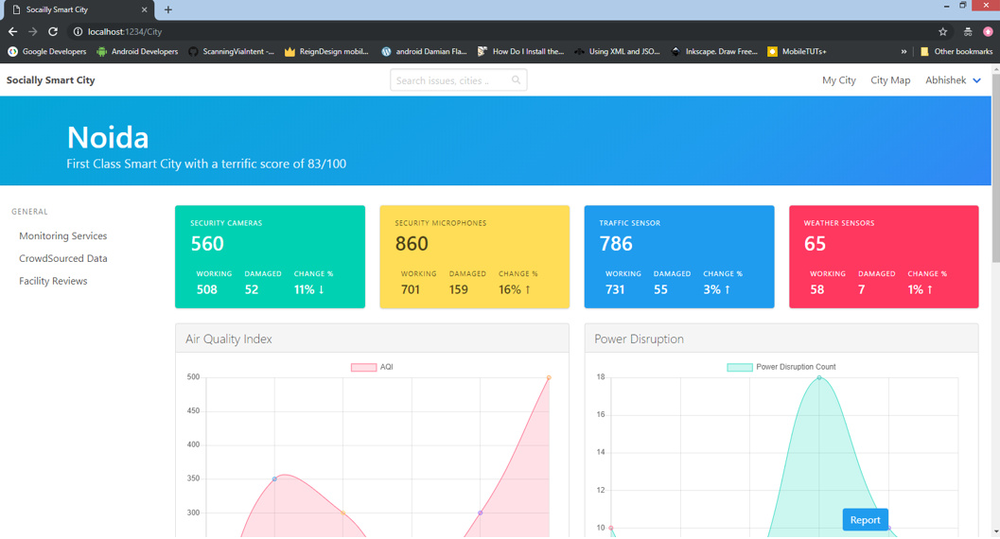
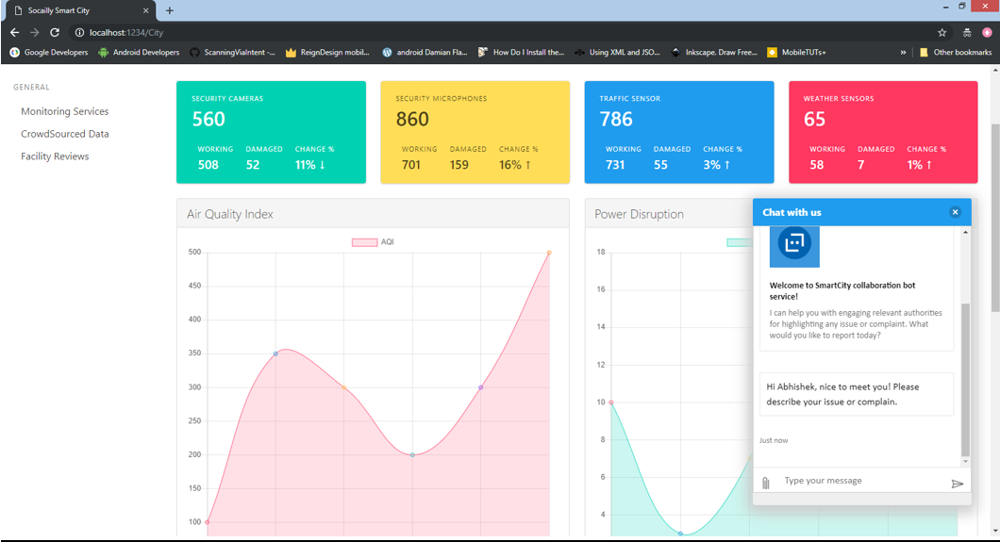
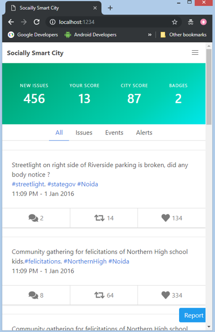
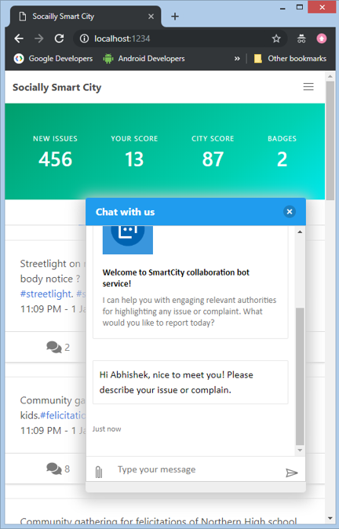

# Socially Smart City

App for colabration between citizen and City authorties

Developed for Barco Geekathon
***

### To Install dependencies 

 ` npm install `

***

### To Run App

` npm run develop `

***
### Solution Overview

***
### App flow

User View

City View

Bot Service

Mobile Views

